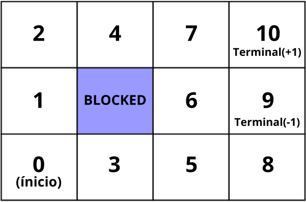

# README - Reinforcement Learning Project with Q-Learning

## Overview

This project implements a Q-Learning algorithm to solve a sequential decision-making problem in a stochastic environment. The environment is represented by a grid with 11 states, where the agent must navigate from an initial state (0) to one of the terminal states (9 or 10), which have rewards of -1 and +1, respectively.

## Project Structure

The code is organized in a Jupyter notebook with the following main sections:

1. **Transition Matrices**: Defines the transition probabilities between states for each possible action (up, down, left, right).

2. **Helper Functions**:

   * `calc_action_result`: Simulates stochastic transitions between states
   * `choose_best_action`: Selects the action with the highest Q-value
   * `q_update`: Implements the Q-Learning update rule
   * `simulate_policy`: Runs the learned policy
   * `print_policy`: Displays the policy in a grid format

3. **Initialization**: Sets the algorithm parameters and initializes the Q-table.

4. **Learning**: Executes the Q-Learning training process.

5. **Simulation**: Tests the learned policy.

## How to Run

1. Run the notebook in Jupyter or platforms like Google Colab.

2. The code can be executed cell by cell or all at once.

## Algorithm Parameters

* **Alpha (α)**: Learning rate (0.2 in the example)
* **Gamma (γ)**: Discount factor (0.5 in the example)
* **Number of trajectories**: 5000 in the example
* **Rewards**:

  * Non-terminal states: -0.04
  * Terminal state 9: -1
  * Terminal state 10: +1

## Expected Results

When running the code, you will see:

1. A visualization of the environment (if the image is available)
2. Verification of the transition matrices
3. The final Q-table after training
4. The learned policy displayed graphically
5. Count of visits for each state-action pair
6. A simulation of the learned policy

## Customization

You can modify:

* The transition matrices in `T`
* The rewards in `reward_vector`
* The learning parameters (ALPHA, GAMMA)
* The number of training trajectories

## Contribution

Contributions are welcome! You can:

* Implement proposed exercises
* Add new visualizations
* Improve the documentation
* Propose algorithm extensions

## License

This project is licensed under the MIT License.
